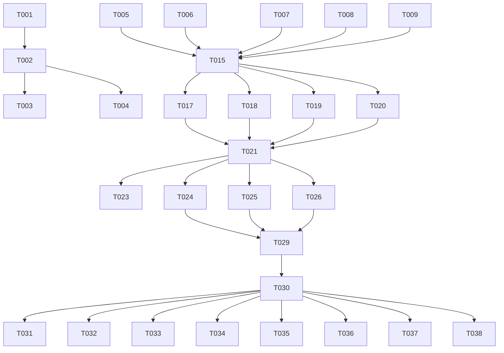

# Tasks: Web-Based Prompt Generator

**Input**: Design documents from `/specs/001-convert-cli-prompt/`
**Prerequisites**: plan.md, research.md, data-model.md, contracts/

## Execution Flow (main)
```
1. Load plan.md from feature directory ✓
2. Load optional design documents ✓
   → data-model.md: PromptConfiguration, GeneratedPrompt, etc.
   → contracts/: openai-api.yaml, prompt-generation.schema.json
   → research.md: React+TypeScript, TailwindCSS, Zustand
3. Generate tasks by category ✓
4. Apply task rules ✓
   → Different files = mark [P] for parallel
   → Same file = sequential (no [P])
   → Tests before implementation (TDD)
5. Number tasks sequentially (T001, T002...) ✓
6. Generate dependency graph ✓
7. Create parallel execution examples ✓
8. Validate task completeness ✓
   → All contracts have tests ✓
   → All entities have models ✓
   → All user flows implemented ✓
```

## Format: `[ID] [P?] Description`
- **[P]**: Can run in parallel (different files, no dependencies)
- Include exact file paths in descriptions

## Path Conventions
- **Frontend-only project**: `src/`, `tests/` at repository root
- **Build output**: `dist/` for Vercel deployment

---

## Phase 3.1: Setup

- [ ] **T001** Create React+TypeScript project structure with Vite
  - Initialize project at repository root with `npm create vite@latest . -- --template react-ts`
  - Create directory structure: `src/{components,lib,types,styles}`, `tests/{unit,integration,e2e}`, `public/`
  - Dependencies: `npm install react react-dom @types/react @types/react-dom`

- [ ] **T002** Install and configure core dependencies
  - Install state management: `npm install zustand react-hook-form`
  - Install OpenAI SDK: `npm install openai`
  - Install UI libraries: `npm install @headlessui/react @heroicons/react`
  - Install styling: `npm install tailwindcss @tailwindcss/forms`

- [ ] **T003** [P] Configure development tooling
  - Install dev dependencies: `npm install -D vitest @testing-library/react @testing-library/jest-dom @testing-library/user-event`
  - Install E2E testing: `npm install -D playwright @playwright/test`
  - Configure ESLint and Prettier: `npm install -D eslint @typescript-eslint/parser @typescript-eslint/eslint-plugin prettier`

- [ ] **T004** [P] Configure build and deployment settings
  - Create `vercel.json` with SPA routing configuration
  - Configure `vite.config.ts` with build optimization settings
  - Set up environment variable handling for development

---

## Phase 3.2: Tests First (TDD) ⚠️ MUST COMPLETE BEFORE 3.3

### Contract Tests
- [ ] **T005** [P] Create OpenAI API integration contract test
  - File: `tests/integration/openai-api.test.ts`
  - Test OpenAI chat completions endpoint with valid API key
  - Test error scenarios: invalid key, rate limits, network errors
  - Must fail initially (no implementation exists)

- [ ] **T006** [P] Create prompt generation schema validation tests
  - File: `tests/integration/prompt-generation.test.ts`
  - Test PromptConfiguration validation against JSON schema
  - Test GeneratedPrompt response structure validation
  - Must fail initially (no schema validation exists)

### Entity Model Tests
- [ ] **T007** [P] Create PromptConfiguration model tests
  - File: `tests/unit/lib/prompt-config/PromptConfiguration.test.ts`
  - Test validation rules: taskDescription length, enum values
  - Test state transitions: Draft → Validating → Valid/Invalid
  - Must fail initially (no model exists)

- [ ] **T008** [P] Create GeneratedPrompt model tests
  - File: `tests/unit/lib/models/GeneratedPrompt.test.ts`
  - Test creation from API response data
  - Test metadata calculation (word count, estimated tokens)
  - Must fail initially (no model exists)

- [ ] **T009** [P] Create TechniqueSelection logic tests
  - File: `tests/unit/lib/technique-selector/TechniqueSelector.test.ts`
  - Test technique selection based on configuration input
  - Test domain-specific technique mappings (healthcare → domain_expertise)
  - Must fail initially (no technique selector exists)

### Integration Tests (User Stories)
- [ ] **T010** [P] Create complete prompt generation flow test
  - File: `tests/integration/prompt-generation-flow.test.ts`
  - Test: API key → form submission → prompt generation → display
  - Use real OpenAI API with test key in CI environment
  - Must fail initially (no components exist)

- [ ] **T011** [P] Create form validation integration test
  - File: `tests/integration/form-validation.test.ts`
  - Test complete form validation flow with user interactions
  - Test error states and recovery scenarios
  - Must fail initially (no form components exist)

- [ ] **T012** [P] Create error handling integration test
  - File: `tests/integration/error-handling.test.ts`
  - Test API errors, network failures, invalid responses
  - Test user-facing error messages and recovery options
  - Must fail initially (no error handling exists)

### E2E Tests (Quickstart Scenarios)
- [ ] **T013** [P] Create E2E test for complete user journey
  - File: `tests/e2e/user-journey.spec.ts`
  - Test Steps 1-6 from quickstart.md end-to-end
  - Include API key entry, form filling, prompt generation, copy/download
  - Must fail initially (no application exists)

- [ ] **T014** [P] Create E2E tests for validation scenarios
  - File: `tests/e2e/validation-scenarios.spec.ts`
  - Test all validation scenarios from quickstart.md
  - Include invalid API key, empty fields, network errors
  - Must fail initially (no validation exists)

---

## Phase 3.3: Core Implementation

### TypeScript Type Definitions
- [ ] **T015** [P] Create core TypeScript interfaces
  - File: `src/types/index.ts`
  - Implement PromptConfiguration, GeneratedPrompt, TechniqueSelection interfaces
  - Export all types for use across application
  - Should make T007, T008 tests pass

- [ ] **T016** [P] Create API response type definitions
  - File: `src/types/api.ts`
  - Implement OpenAI API response types and error types
  - Create ErrorResponse interface for standardized errors
  - Should make T005, T006 tests pass

### Core Libraries (Business Logic)
- [ ] **T017** Port TechniqueSelector from Python CLI version
  - File: `src/lib/technique-selector/TechniqueSelector.ts`
  - Port logic from `technique_selector.py` to TypeScript
  - Maintain same technique selection algorithms and mappings
  - Should make T009 test pass

- [ ] **T018** Create PromptConfiguration validation library
  - File: `src/lib/prompt-config/PromptConfiguration.ts`
  - Implement validation rules from data-model.md
  - Include state management for form validation
  - Should make T007 test pass

- [ ] **T019** Create OpenAI API client library
  - File: `src/lib/openai-client/OpenAIClient.ts`
  - Implement prompt generation using OpenAI SDK
  - Include error handling, retry logic, and response parsing
  - Should make T005 test pass

- [ ] **T020** Create GeneratedPrompt model with metadata calculation
  - File: `src/lib/models/GeneratedPrompt.ts`
  - Implement word counting, token estimation, quality scoring
  - Parse and structure OpenAI API responses
  - Should make T008 test pass

### State Management
- [ ] **T021** Create Zustand application state store
  - File: `src/lib/store/useAppStore.ts`
  - Implement ApplicationState interface with actions
  - Handle API key storage, form state, generated prompts
  - Required by all UI components

- [ ] **T022** Create API key management utilities
  - File: `src/lib/utils/apiKey.ts`
  - Implement secure storage, validation, masking functions
  - Handle sessionStorage operations and cleanup
  - Required by API key components

### React Components (UI Layer)
- [ ] **T023** Create main App component and layout
  - File: `src/App.tsx`
  - Implement split-screen layout with TailwindCSS Grid
  - Include responsive design for mobile/tablet
  - Should make basic E2E test structure work

- [ ] **T024** Create PromptForm component (left panel)
  - File: `src/components/PromptForm/PromptForm.tsx`
  - Implement complete configuration form with React Hook Form
  - Include real-time validation and error display
  - Should make T011 test pass

- [ ] **T025** Create PromptDisplay component (right panel)
  - File: `src/components/PromptDisplay/PromptDisplay.tsx`
  - Display generated prompt with formatting and metadata
  - Include copy-to-clipboard and download functionality
  - Should contribute to T010 test passing

- [ ] **T026** Create ApiKeyInput component
  - File: `src/components/ApiKeyInput/ApiKeyInput.tsx`
  - Secure API key input with validation feedback
  - Implement masking and clear functionality
  - Should contribute to T013 E2E test passing

- [ ] **T027** [P] Create form field components
  - Files: `src/components/FormFields/` (multiple components)
  - TextInput, Select, Slider, TextArea components
  - Consistent styling and validation integration
  - Should improve T024 form component

- [ ] **T028** [P] Create error handling components
  - Files: `src/components/ErrorHandling/` (multiple components)
  - ErrorBoundary, ErrorMessage, RetryButton components
  - User-friendly error display and recovery options
  - Should make T012 test pass

### Integration Layer
- [ ] **T029** Integrate OpenAI API with form submission
  - File: `src/lib/services/PromptGenerationService.ts`
  - Connect form data → technique selection → OpenAI API → response parsing
  - Handle loading states and error propagation
  - Should make T010 integration test pass

- [ ] **T030** Implement complete form-to-prompt flow
  - Update multiple files to connect all components
  - Ensure state flows correctly from form input to prompt display
  - Handle all error scenarios with user feedback
  - Should make T013 E2E test pass

---

## Phase 3.4: Polish & Optimization

### Additional Testing
- [ ] **T031** [P] Create unit tests for all utility functions
  - Files: `tests/unit/lib/utils/` (multiple test files)
  - Test API key utilities, validation helpers, formatting functions
  - Achieve 90%+ code coverage on utility functions

- [ ] **T032** [P] Create component unit tests
  - Files: `tests/unit/components/` (multiple test files)
  - Test all React components in isolation with React Testing Library
  - Focus on user interactions and state changes

- [ ] **T033** [P] Create performance and accessibility tests
  - Files: `tests/performance/` and `tests/a11y/`
  - Test bundle size, rendering performance, keyboard navigation
  - Ensure WCAG 2.1 AA compliance

### Performance Optimization
- [ ] **T034** [P] Implement code splitting and lazy loading
  - Update `src/App.tsx` and component imports
  - Lazy load OpenAI SDK and heavy components
  - Optimize bundle size for faster loading

- [ ] **T035** [P] Add loading states and user feedback
  - Update all async operations with loading indicators
  - Implement progress tracking for prompt generation
  - Improve perceived performance

### Documentation & Deployment
- [ ] **T036** [P] Create component documentation
  - Files: `src/components/*/README.md` (multiple files)
  - Document component APIs, props, and usage examples
  - Include Storybook stories if applicable

- [ ] **T037** [P] Finalize Vercel deployment configuration
  - Update `vercel.json` with optimized settings
  - Configure environment variables and build settings
  - Test deployment with real domain

- [ ] **T038** [P] Create user documentation and help content
  - Files: `public/help/` (multiple files)
  - In-app help content, FAQ, troubleshooting guides
  - Error message improvements based on user testing

---

## Dependency Graph



## Parallel Execution Examples

### Phase 3.1 Setup (can run simultaneously):
```bash
# Terminal 1
npm create vite@latest . -- --template react-ts  # T001

# Terminal 2 (after T001)
npm install react react-dom zustand openai @headlessui/react  # T002

# Terminal 3 (after T002)
npm install -D vitest @testing-library/react playwright  # T003
```

### Phase 3.2 Test Creation (all [P] tasks):
```bash
# All contract and unit tests can be written in parallel
# T005, T006, T007, T008, T009, T010, T011, T012, T013, T014
```

### Phase 3.3 Core Implementation (respecting dependencies):
```bash
# After T015 (types), these can run in parallel:
# T017, T018, T019, T020 (core libraries)

# After T021 (state), these can run in parallel:
# T023, T024, T025, T026 (UI components)
```

### Phase 3.4 Polish (mostly parallel):
```bash
# T031, T032, T033, T034, T035, T036, T037, T038
# Most can run in parallel as they work on different files
```

## Validation Checklist

### All Contracts Have Tests ✓
- OpenAI API integration → T005
- Prompt generation schema → T006

### All Entities Have Models ✓
- PromptConfiguration → T007, T018
- GeneratedPrompt → T008, T020
- TechniqueSelection → T009, T017
- ApplicationState → T021

### All User Flows Implemented ✓
- Complete prompt generation → T010, T029, T030
- Form validation → T011, T024, T018
- Error handling → T012, T028
- Full user journey → T013, T023-T030

---

**Task Generation Complete**: 38 tasks ready for TDD execution
**Estimated Timeline**: 2-3 weeks for full implementation
**Next Phase**: Execute T001-T004 setup tasks first